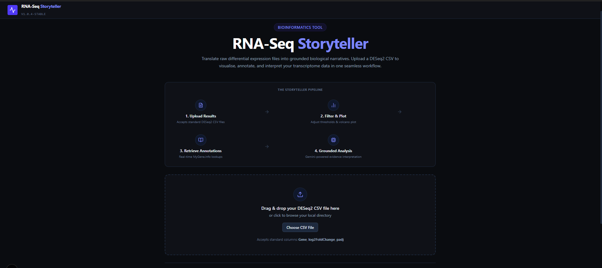
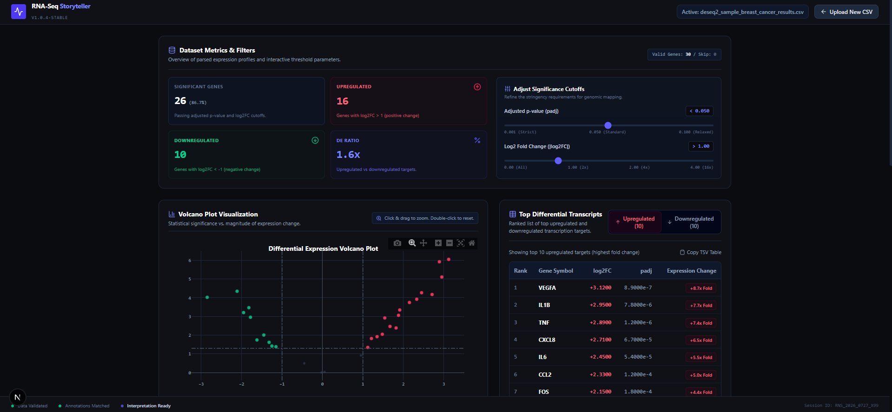
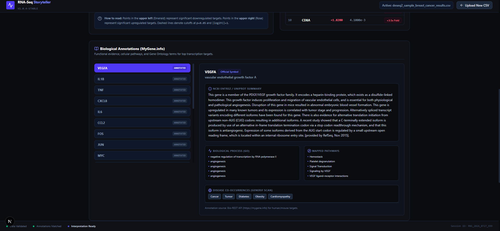
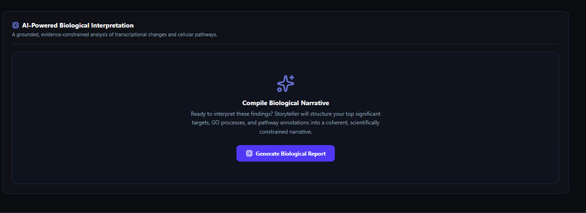

# 🧬 RNA-Seq Storyteller

**From Differential Expression to Biological Insight.**

RNA-Seq Storyteller is a web application that automates the first-pass biological interpretation of RNA-seq differential expression results. Upload a DESeq2 output file and it validates your data, visualizes it, retrieves real biological annotations, and produces an AI-generated interpretation grounded strictly in that annotation evidence — all in one workflow, exportable as a downloadable report.

---

## 🔗 Live App

**[https://rna-seq-storyteller.vercel.app](https://rna-seq-storyteller.vercel.app)**

Open it, click **"Use Sample Dataset"** if you don't have a DESeq2 CSV on hand, and the full pipeline runs end to end.

---

## 🎯 The Problem — and Who Has It

RNA-seq differential expression analysis produces thousands of gene expression values. Turning that into a biological story is one of the most time-consuming parts of the workflow: researchers routinely switch between multiple annotation databases (GO, KEGG, Reactome), look up genes one at a time, and manually write up what the results mean — often for a small, targeted gene panel where the stakes of getting the interpretation right are high.

This is a real bottleneck for:
- **Bioinformatics and biology students**, who are learning to interpret DE results and don't yet have a mental map of which databases to check
- **Graduate researchers and lab scientists**, who need a fast, credible first-pass interpretation before deeper manual review
- **Instructors**, who need a clean way to demonstrate the full RNA-seq interpretation workflow in one sitting

RNA-Seq Storyteller doesn't replace that manual review — it removes the repetitive assembly work, so a researcher's time goes into evaluating the interpretation instead of gathering the inputs for it.

**Note on originality:** this project is my own design, not a template or clone. Similar academic tools exist in the literature (e.g. multi-database enrichment chatbots with PubMed-grounded interpretation) — this app doesn't claim to be novel research. Its value is being lightweight, DESeq2-specific, and beginner-facing: a single guided session instead of stitching together five separate tools.

---

## ✅ Features

- **Landing page** with workflow overview, sample dataset, and a clear research/educational-use disclaimer
- **DESeq2 CSV upload** — accepts standard `Gene`, `log2FoldChange`, `padj` format
- **Data validation** — catches missing required columns, empty files, missing values, and duplicate gene entries, each with a specific, readable error message (not a raw crash)
- **Dataset summary** — total genes, significant genes, upregulated/downregulated counts, valid vs. skipped rows
- **Adjustable significance thresholds** — live sliders for adjusted p-value and |log2FoldChange| cutoffs, with all downstream results (counts, plot, tables) recalculating instantly
- **Interactive volcano plot** — log2FoldChange vs. -log10(padj), significant genes highlighted, zoom/pan/reset, hover tooltips
- **Top gene tables** — ranked top 10 upregulated and top 10 downregulated genes with fold-change and p-value
- **Real biological annotation retrieval** — live lookups via the MyGene.info API for gene function, GO biological processes, mapped pathways, and disease co-occurrences
- **Stale-report detection** — if you change the significance thresholds after generating an AI report, the app flags that the report is now out of date and offers to regenerate
- **AI-powered biological interpretation** — see below
- **Report export** — download the full interpretation as a PDF

---

## 🤖 The AI Feature

**Model:** Gemini

**What it does:** Once significant genes are identified and annotated, the app builds a structured **evidence package** — dataset statistics, top up/downregulated genes, their GO terms, pathways, and disease associations — and sends *only that structured evidence* to Gemini. The raw CSV is never sent to the model. This is a deliberate design choice: it means every claim the AI makes is traceable back to real annotation data, not the model's general training knowledge.

**System prompt / instructions (written by me):**

```
You are an RNA-seq interpretation assistant.

Use ONLY the supplied biological evidence.
Do not invent pathways.
Do not infer unsupported biology.
Explain the biological significance.
State uncertainty where appropriate.
Produce a clear research summary.
```

**Output structure the AI is instructed to follow:**
1. Dataset Summary & Overview
2. Key Findings & Top Genes
3. Major Biological Processes & Pathways
4. Coordinated Cellular Response & Potential Interpretation
5. Study Limitations & Gaps in Evidence
6. Suggested Follow-Up Experiments

In testing, this constraint held up in practice — for example, when a gene in the evidence package had no functional annotation available, the AI explicitly flagged "No functional summary available for this gene" rather than filling the gap with invented biology, and hedged inference-based claims (e.g. pathway activation not directly measured) with language like "indirectly points toward potential activation" rather than stating them as fact.

---

## 🛠️ Built With

| Category | Tool / Service |
|---|---|
| Frontend | React (Next.js) |
| Backend | Next.js API routes |
| AI model | Gemini API |
| Charts | Plotly.js |
| Biological annotation source | MyGene.info API |
| Build environment | Google AI Studio |
| Hosting / Deployment | Vercel |
| Version control | GitHub |

No database is used — the app is stateless per session by design.

---

## 📸 Screenshots

**1. Landing page & upload**


**2. Dataset metrics, threshold controls & volcano plot**


**3. Biological annotation panel (real MyGene.info data)**


**4. AI-powered interpretation panel**


---

## 🚀 How to Run This Project

### Option 1 — Use the live app (easiest)
Just visit **[https://rna-seq-storyteller.vercel.app](https://rna-seq-storyteller.vercel.app)** — no setup needed.

### Option 2 — Run it locally

1. **Clone the repository**
   ```bash
   git clone https://github.com/samhere3116-maker/rna-seq-storyteller.git
   cd rna-seq-storyteller
   ```

2. **Install dependencies**
   ```bash
   npm install
   ```

3. **Set up environment variables**
   Copy `.env.example` to `.env.local` and fill in your own values:
   ```
   GEMINI_API_KEY=your_gemini_api_key_here
   APP_URL=http://localhost:3000
   ```
   Get a Gemini API key from [aistudio.google.com/apikey](https://aistudio.google.com/apikey).

4. **Run the development server**
   ```bash
   npm run dev
   ```

5. **Open** [http://localhost:3000](http://localhost:3000) in your browser.

6. **Try it** — click "Use Sample Dataset" for an instant demo, or upload your own DESeq2 results CSV with `Gene`, `log2FoldChange`, and `padj` columns.

---

## ⚠️ Disclaimer

RNA-Seq Storyteller is designed for research support and educational purposes only. It is not approved for diagnostic use, clinical analysis, or medical decision-making. All AI-generated biological hypotheses must be validated through experimental methodologies.

---

## 🔮 Future Improvements (not built in this version)

- Compare two datasets side by side
- KEGG pathway visualization and heatmaps
- Multiple species support
- Standalone gene search
- Saved analysis history

---

## 👤 Author

Saman Rashid — BS Bioinformatics, International Islamic University, Islamabad
Built as an individual final project for the AI Internship / AI Skillbridge Program.
